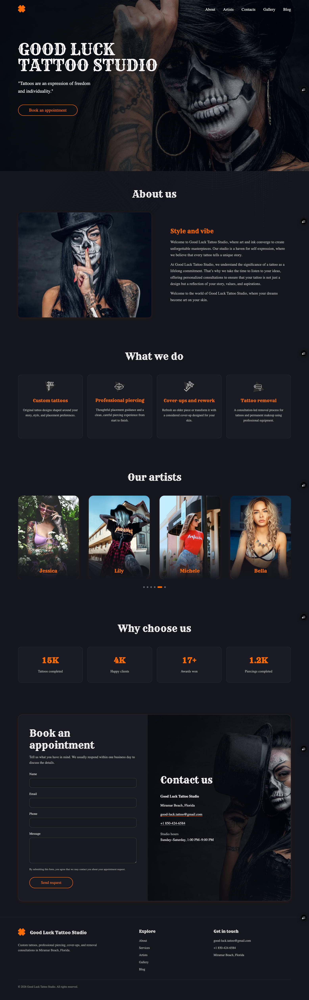
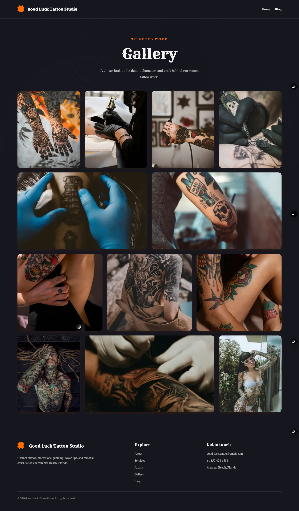
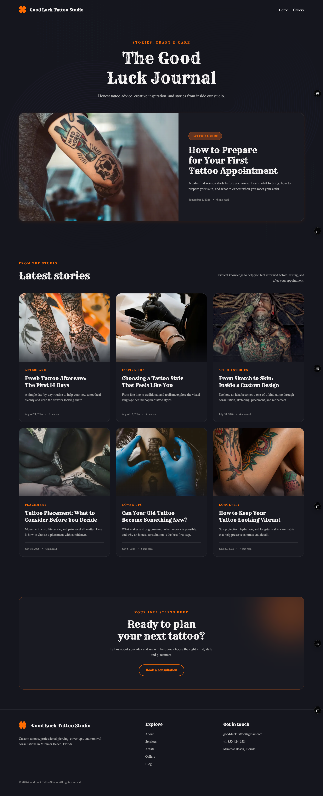

# Tattoo Studio

The home page introduces the studio, its services, artists, experience, and contact details. It includes smooth section navigation, an artist carousel, an appointment request form, direct contact links, and responsive navigation for mobile devices.

The gallery page presents selected tattoo work in a responsive image grid that adapts across mobile, tablet, and desktop screens. Its shared header provides quick navigation to the home page and blog, while the footer contains studio links and contact information.

The blog page features tattoo guides, aftercare advice, studio stories, and design inspiration. It highlights a featured article, displays recent posts in a responsive card layout, and includes a consultation call to action that leads visitors to the booking section.
